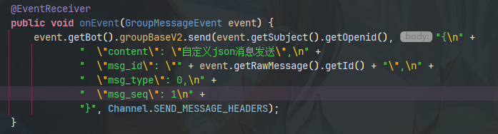

## QQ频道机器人 Java SDK 非官方 文档
_**待完善..**_
<hr>

### 包目录说明:

- [api](../src/main/java/io/github/kloping/qqbot/api) 对于整个SDK需要实现的功能的定义并无实现
- [entities](../src/main/java/io/github/kloping/qqbot/entities) QQ频道官方文档数据格式的重写
- [http](../src/main/java/io/github/kloping/qqbot/http) SDK使用到的http请求工具的定义
- [impl](../src/main/java/io/github/kloping/qqbot/impl) 对于SDK api的基本实现
- [network](../src/main/java/io/github/kloping/qqbot/network) SDK的网络层
- [utils](../src/main/java/io/github/kloping/qqbot/utils) sdk 的工具类
- [Resource.java](../src/main/java/io/github/kloping/qqbot/Resource.java) 公用资源类
- [Starter.java](../src/main/java/io/github/kloping/qqbot/Starter.java) 启动类
- [Start0](../src/main/java/io/github/kloping/qqbot/Start0.java) 启动类附属

<hr>

### 相关指引

- **[事件 event](event.md)**
- **[消息 message](message.md)**
- **[动作 action](action.md)**
- **[网络相关设置](network.md)**

<hr>

在配置好项目依赖后 即可使用

[maven仓库](https://repo1.maven.org/maven2/io/github/kloping/bot-qqpd-java/)

#### 启动方式

```java
// 启动类新建
Starter starter = new Starter("appid", "token");
// 私域推荐Intents.PRIVATE_INTENTS 公域机器人推荐 Intents.PUBLIC_INTENTS
starter.getConfig().setCode(Intents.PRIVATE_INTENTS.getCode());
// 切换沙箱与正式环境
starter.getConfig().sandbox();
// 启动
starter.run();
```
#### 事件注册

```java
starter.registerListenerHost(new ListenerHost(){
    @Override
    public void handleException(Throwable e){
    }
    
    //必须要有该注解 否则将不注册
    @EventReceiver
    public void onEvent(MessageChannelReceiveEvent event){
        event.send("Hello World!");
    }
});
```

<hr>

### 日志设置

```java
public class LogDemo {
    public static void main(String[] args) {
        //默认方式
        //日志文件路径 设置为null 时不输出文件
        starter.APPLICATION.logger.setOutFile("./logs/%s.log");
        //日志文件格式
        LoggerImpl.INSTANCE.dfn = new SimpleDateFormat("/yyyy-MM-dd");
    }
}
```
<hr>

### 依赖排斥

- v1.5.0-Beta7 在与com.alibaba.fastjson2:fastjson2
  同时引用时会产生大量空指针[#20](https://github.com/Kloping/qqpd-bot-java/issues/20)

<hr>

### 自定义消息发送 
> 通过http请求达到想要的目的获取bot请求必要的请求头方式

```java
//方法必须在start.run 之后
//频道发送请求必要请求头
starter.APPLICATION.INSTANCE.getContextManager().getContextEntity(Start0.class).getHeaders()
//q群发送请求必要请求头
starter.APPLICATION.INSTANCE.getContextManager().getContextEntity(Start0.class).getHeaders()

```

//其中主动发送qq群

    starter.registerListenerHost(new ListenerHost() {
        @EventReceiver
        public void onEvent(ConnectedEvent event) {
            V2MsgData data = new V2MsgData().setContent("测试主动消息");
            starter.getBot().groupBaseV2.send("8468B15808B8200A56E6DD92EBA51AAC", data.toString(), SEND_MESSAGE_HEADERS);
        }
    });


