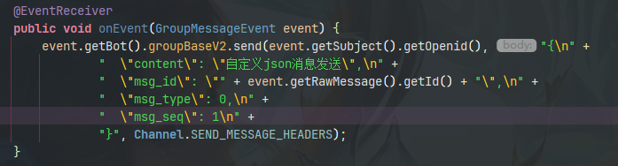

## QQ官方机器人 JavaSDK 开发文档

<hr>

### 包目录说明:

- [api](../src/main/java/io/github/kloping/qqbot/api) 对于整个SDK需要实现的功能的定义并无实现
- [entities](../src/main/java/io/github/kloping/qqbot/entities) QQ频道官方文档数据格式的重写
- [http](../src/main/java/io/github/kloping/qqbot/http) SDK使用到的http请求工具的定义
- [impl](../src/main/java/io/github/kloping/qqbot/impl) 对于SDK api的基本实现
- [network](../src/main/java/io/github/kloping/qqbot/network) SDK的网络层
- [utils](../src/main/java/io/github/kloping/qqbot/utils) sdk 的工具类
- [Resource.java](../src/main/java/io/github/kloping/qqbot/Resource.java) 公用资源类
- [Starter.java](../src/main/java/io/github/kloping/qqbot/Starter.java) 启动类
- [Start0](../src/main/java/io/github/kloping/qqbot/Start0.java) 启动类附属

<hr>

#### 相关部分文档指引

- **[事件 event](event.md)**
- **[消息发送 message](message.md)**
- **[网络相关配置](network.md)**
- **[V2群相关](v2.md)**

<hr>

在配置好项目依赖后 即可使用

> [maven仓库](https://repo1.maven.org/maven2/io/github/kloping/bot-qqpd-java/)

#### 启动流程

> step-1

 登录q.qq开发者平台获得 appid 和 secret 等参数

> step0 启动程序
```java
Starter starter = new Starter("appid", "secret");
// 私域推荐Intents.PRIVATE_INTENTS 公域机器人推荐 Intents.PUBLIC_INTENTS
starter.getConfig().setCode(Intents.PRIVATE_INTENTS.getCode());
// 切换沙箱与正式环境
// starter.getConfig().sandbox();
// 启动
starter.run();
```
#### 事件注册 
> step1 接收事件 tips:方法中参数为Event任一子类或实现
```java
starter.registerListenerHost(new ListenerHost(){
    //必须要有该注解 否则将不注册
    @EventReceiver
    public void onEvent(MessageEvent event){
        event.send("Hello World!");
    }
});
```

### 消息发送
> step2 发送消息   tips: MessageEvent exts Sender
- 发送文本`sender.send("文本");`
- 发送图片
```java
//step1 构造Image
Image image = null;
//图片链接构造
image = new Image(url);
//bytes数据构造
image = new Image(bytes);        
//step2 send
sender.send(image);
```
- 发送 markdown

      event.send(new Markdown("custom_template_id")
        //申请的模板 参数填充
        .addParam("key", "value")
        //可选 设置按钮模板 
        .setKeyboard("id"));   


<hr>

### 其他设置项

#### 日志设置

日志通过 SLF4J 输出，SDK 默认同时输出到控制台和日志文件。
所有日志配置都需要在 `starter.run()` 之前设置。

| 配置 | 默认值 | 说明 |
| --- | --- | --- |
| `logLevel` | `1` | 默认不输出 `Normal`，输出 `Info`、`Debug` 和 `Error` |
| `logToFile` | `true` | 是否由 SDK 自己写日志文件 |
| `logFileDir` | `./logs/%s.log` | 日志文件路径，`%s` 会替换为日期 |

日志级别说明：

- `-1`：输出全部日志
- `0`：输出 `Normal`、`Info`、`Debug` 和 `Error`
- `1`：默认设置，不输出 `Normal`
- `2`：只输出 `Debug` 和 `Error`

```java
Starter starter = new Starter("appid", "secret");

// 默认：控制台 + ./logs/yyyy-MM-dd.log，Normal 不输出
starter.getConfig().setLogLevel(1);

// 输出 Normal 日志，例如 logger.log("...") 产生的日志
starter.getConfig().setLogLevel(0);

// 自定义日志文件路径
starter.getConfig().setLogFileDir("./logs/qqbot-%s.log");

// 关闭 SDK 自己的文件输出，只通过 SLF4J/Logback 输出
starter.getConfig().setLogToFile(false);

starter.run();
```

如果需要在运行过程中调整全局日志对象，可以直接使用 SDK 的日志对象：

```java
starter.run();

LoggerImpl.INSTANCE.setLogLevel(0); // 开启 Normal
LoggerImpl.INSTANCE.setOutFile("./logs/%s.log");
LoggerImpl.INSTANCE.setPrefix("[my-bot]");
LoggerImpl.INSTANCE.setFormat(new SimpleDateFormat("MM/dd-HH:mm:ss:SSS"));
LoggerImpl.INSTANCE.dfn = new SimpleDateFormat("/yyyy-MM-dd");
```

其中 `setFormat` 控制日志行中的时间格式，`dfn` 控制日志文件名中的日期格式。

#### Spring Boot 项目中的日志配置

在 Spring Boot 项目中，建议关闭 SDK 自己的文件输出，由 Spring Boot 的 Logback 统一管理文件和控制台：

`application.yml`：

```yaml
qqbot:
  log-level: 1       # 0 开启 Normal，1 默认过滤 Normal，2 仅 Debug/Error，-1 全部
  log-to-file: false # 交给 Spring Boot 管理文件输出

logging:
  level:
    io.github.kloping.qqbot: INFO # 输出 Info/Error；需要 Debug 时改为 DEBUG
  file:
    name: logs/qqbot.log
```

读取配置并应用到 SDK：

```java
@Bean
public Starter qqBot(Environment environment) {
    Starter starter = new Starter("appid", "secret");
    starter.getConfig().setLogLevel(
            environment.getProperty("qqbot.log-level", Integer.class, 1));
    starter.getConfig().setLogToFile(
            environment.getProperty("qqbot.log-to-file", Boolean.class, false));
    starter.run();
    return starter;
}
```

如果希望 Spring Boot 同时输出 `Normal`，除了将 `qqbot.log-level` 设置为 `0`，还需要保证 `io.github.kloping.qqbot` 的 Logback 级别允许输出 `INFO`。
<hr>


#### 自定义消息发送 
> 通过http请求达到想要的目的获取bot请求必要的请求头方式

```java
//方法必须在start.run 之后
//频道发送请求必要请求头
starter.APPLICATION.INSTANCE.getContextManager().getContextEntity(Start0.class).getHeaders()
//q群发送请求必要请求头
starter.APPLICATION.INSTANCE.getContextManager().getContextEntity(Start0.class).getHeaders()

```

//其中主动发送qq群

    starter.registerListenerHost(new ListenerHost() {
        @EventReceiver
        public void onEvent(ConnectedEvent event) {
            V2MsgData data = new V2MsgData().setContent("测试主动消息");
            starter.getBot().groupBaseV2.send("groupOpenId", data.toString(), SEND_MESSAGE_HEADERS);
        }
    });


### 依赖排斥

- v1.5.0-Beta7 在与com.alibaba.fastjson2:fastjson2
  同时引用时会产生大量空指针[#20](https://github.com/Kloping/qqpd-bot-java/issues/20)

<hr>

### 2025/4/18 v1.5.2-R1 + 

> 支持自定义websocket链接地址

对于webhook已开通且无法再进行websocket开发者而言 

可通过[webhook转websocket服务](https://github.com/DevOpen-Club/qbot-webhook-to-websocket)继续使用本项目

from [@NintyCat](https://github.com/NintyCat)

使用代码如下
```java
    //===========================你的自定义地址
    starter.getConfig().setWslink("wss://api.sgroup.qq.com/websocket");
    starter.getConfig().setWebSocketListener(new WebSocketListener() {
        @Override
        public boolean onMessage(WebSocketClient client, String msg) {
            Pack pack = GSON.fromJson(msg, Pack.class);
            // log or syso
            if (pack == null) {
                //TODO
            } else {
                for (OnPackReceive onPackReceive : starter.getWssWorker().getOnPackReceives()) {
                    if (onPackReceive instanceof AuthAndHeartbeat) continue;
                    onPackReceive.onReceive(pack);
                }
            }
            return false;
        }
    });
    start.run();
```

### 1.5.2-R2 

> 初步对webhook链接方式的支持
> 
> 使用该方式链接 其他配置参数将失效

在服务启动后需要将q.qq配置链接设置为 "https://you-domain/webhook0" 路径

> 确保https地址可访问到项目部署机器 #此类问题 不建议开issue

验证完成后确定配置


```java
  //设置webhook服务端口 默认为0时不开启webhook
  starter.getConfig().setWebhookport(81);
```
